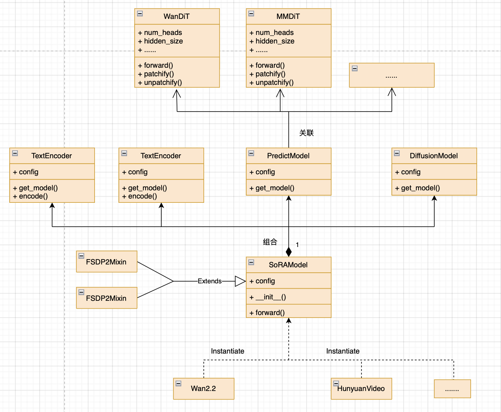

新模型开发
===========================

Last updated: 12/08/2025. Author: cxiaolong

本文档介绍了如何利用 MindSpeed-MM FSDP2后端开发一个基于DiT结构的视频生成模型训练demo。

开发流程
------------

该流程主要包含环境搭建、数据集构建、模型构建、训练入口、训练脚本、启动训练。

环境搭建
------------

1. 硬件准备

昇腾A3或A2加速卡，建议8卡或以上

2. 参考 `环境搭建 <https://mindspeed-mm.readthedocs.io/zh-cn/latest/quick_start/%E7%8E%AF%E5%A2%83%E6%90%AD%E5%BB%BA.html>`_ 章节，完成HDK、CANN、PyTorch和TorchNPU基础环境搭建；

3. 创建并激活Python虚拟环境；

.. code:: bash

    conda create -n [env_name] python=3.10
    conda activate [env_name]
    # 安装CANN latest下的te包，这会自动安装sympy,decorator等必装包
    pip install [CANN_HOME_PATH]/ascend-toolkit/latest/lib64/te-*-py3-none-any.whl

4. 按照下面的步骤安装MindSpeed-MM及其依赖包：

.. code:: bash

    git clone https://gitcode.com/Ascend/MindSpeed-MM.git
    git clone https://github.com/NVIDIA/Megatron-LM.git
    cd Megatron-LM
    git checkout core_v0.12.1
    cp -r megatron ../MindSpeed-MM/
    cd ..
    cd MindSpeed-MM
    mkdir logs data ckpt

    # 安装加速库
    git clone https://gitcode.com/Ascend/MindSpeed.git
    cd MindSpeed
    # checkout commit from MindSpeed core_r0.12.1
    git checkout 93c45456c7044bacddebc5072316c01006c938f9
    # 安装mindspeed及依赖
    pip install -e .
    cd ..

    # 安装mindspeed mm及依赖
    pip install -e .

Step1: 数据集构建
--------------------

准备demo数据
^^^^^^^^^^^^^^

请准备训练的demo数据，并组织成如下格式：

.. code:: text

    ├── data
        ├── data.json
        ├── videos
            ├── video000001.mp4
            ├── video000002.mp4
            ├── ...

videos/下存放视频文件，data.json中包含该数据集中所有的视频-文本对信息，具体示例如下：

.. code:: json

    [
        {
            "path": "./videos/video000001.mp4",
            "cap": "A scenic view of mountains during sunrise.",
            "num_frames": 81,
            "fps": 24,
            "resolution": {480, 832}
        },
        {
            "path": "./videos/video000002.mp4",
            "cap": "A bustling city street with people walking and cars passing by.",
            "num_frames": 81,
            "fps": 24,
            "resolution": {480, 832}
        },
        ...
    ]

Dataset 构建
^^^^^^^^^^^^^^^^^^^

可以使用MM仓上已有的T2V相关DataSet，也可以自行定义数据集，本教程使用自定义的CustomT2VDataset。

新建 ``data/datasets/custom_t2v_dataset.py``

.. code:: python

    import os
    from PIL import Image
    import numpy as np
    import pandas as pd
    import torch
    from torch.utils.data import Dataset
    import torchvision
    from torchvision import transforms
    from transformers import AutoTokenizer

    from mindspeed_mm.data.datasets.mm_base_dataset import MMBaseDataset
    from mindspeed_mm.data.data_utils.data_transform import ResizeVideo, ToTensorVideo, CenterCropResizeVideo
    from mindspeed_mm.data.data_utils.utils import TextProcesser
    from mindspeed_mm.data.data_utils.video_processor import AbstractVideoProcessor

    class CustomT2VDataset(MMBaseDataset):
        def __init__(
            self,
            video_folder,
            json_path,
            tokenizer_config,
            num_frames=49,
            frame_interval=1,
            max_height=480,
            max_width=832,
            **kwargs
        ):
            super().__init__(**kwargs)

            self.data_samples = pd.read_json(json_path, lines=True)
            self.video_folder = video_folder
            self.num_frames = num_frames
            self.frame_interval = frame_interval

            # Initialize tokenizer and text processor
            tokenizer = AutoTokenizer.from_pretrained(tokenizer_config)
            self.text_processer = TextProcesser(
                tokenizer=tokenizer,
                text_preprocess_methods=[
                    {"method": "basic_clean"},
                    {"method": "whitespace_clean"}
                ],
            )

            # Initialize video processor
            self.video_processor = CustomVideoProcessor(
                num_frames=num_frames, 
                frame_interval=frame_interval, 
                max_height=max_height, 
                max_width=max_width
            )

        def __getitem__(self, index):
            sample = self.data_samples.iloc[index]

            file_name = sample["path"]
            captions = sample["cap"]
            video_path = os.path.join(self.video_folder, file_name)

            # Process text
            prompt_ids, prompt_mask = self.text_processer(captions)

            # Read video
            try:
                vframes, _ = torchvision.io.read_video(
                    video_path, 
                    pts_unit="sec", 
                    output_format="TCHW"
                )

            # Process video
            video_tensor = self.video_processor(vframes)

            # Ensure tensors are in correct format
            if isinstance(prompt_ids, list):
                prompt_ids = torch.tensor(prompt_ids)
            if isinstance(prompt_mask, list):
                prompt_mask = torch.tensor(prompt_mask)

            return {
                "video": video_tensor,  # Shape: CTHW
                "prompt_ids": prompt_ids,
                "prompt_mask": prompt_mask
            }

    class CustomVideoProcessor(AbstractVideoProcessor):
        def __init__(self, num_frames, frame_interval, max_height, max_width):
            super().__init__(num_frames, frame_interval)
            
            self.max_height = max_height
            self.max_width = max_width

            self.video_transforms = transforms.Compose([
                ResizeVideo(
                    transform_size={"max_height": max_height, "max_width": max_width},
                    interpolation_mode="bilinear",
                    antialias=True,
                    mode="shortside"
                ),
                ToTensorVideo(),
                transforms.Normalize(mean=[0.5, 0.5], std=[0.5, 0.5]),
                CenterCropResizeVideo(transform_size="auto", antialias=True)
            ])

        def __call__(self, vframes):
            num_frames_total = vframes.shape[0]

            # Generate initial frame indices
            frame_indices = np.arange(0, num_frames_total, self.frame_interval).astype(int)
            frame_indices = frame_indices[frame_indices < self.num_frames]

            # Random temporal cropping for long sequences
            if len(frame_indices) > self.num_frames:
                begin_index, end_index = self.temporal_sample(len(frame_indices))
                frame_indices = frame_indices[begin_index: end_index]
            elif len(frame_indices) < self.num_frames:
                raise IndexError(
                    f"video has {num_frames} frames, but need to sample {len(frame_indices)} frames ({frame_indices})"
                )
            return video

DataLoader 构建
^^^^^^^^^^^^^^^^^^^

MindSpeed-MM 提供了丰富的DataLoader组件，调用入口为 ``mindspeed_mm/data/build_mm_dataloader`` ，当前实现了三种类型可供选择：

* ``base`` ： 封装了原生的 ``torch.utils.data.DataLoader`` 
* ``sampler`` ： 通过构建自定义分布式训练Sampler封装的DataLoader
* ``variable`` ： 支持动态分辨率的DataLoader

本教程选择使用 ``sampler`` 类型的DataLoader

模型构建
-------------

MindSpeed-MM 中提供了一个SoRAModel作为所有扩散视频生成模型的组合类，模型继承关系如下。SoRAModel是一个组合类，可以实例化成Wan、HunyuanVideo等具体的模型，由TextEncoder、PredictModel、DiffusionModel、AEModel多个部件组成。

本教程将构建一个 ``CustomModel`` 用于表示视频生成模型的组合类，它由 ``PrediciModel(CustomDiT)``, ``TextEncoder(UMT5)``, ``AEModel(WanVideoVAE)``, ``DiffusionModel(WanFlowMatchScheduler)`` 四部分组成。

CustomModel构建
^^^^^^^^^^^^^^^^^^^^^

.. code:: python

    import torch
    from torch import nn

    from mindspeed_mm.models.ae import AEModel
    from mindspeed_mm.models.diffusion import DiffusionModel
    from mindspeed_mm.models.text_encoder import TextEncoder
    from mindspeed_mm.models.predictor import PredictModel
    from mindspeed_mm.models.transformers.base_model import FSDP2Mixin, WeightInitMixin

    class CustomModel(nn.Module, FSDP2Mixin, WeightInitMixin):
        def __init__(self, config) -> None:
            self.ae = AEModel(config.ae).eval()
            self.ae.requires_grad_(False)
            self.text_encoder = TextEncoder(config.text_encoder).eval()
            self.text_encoder.requires_grad_(False)
            self.diffusion = DiffusionModel(config.diffusion).get_model()
            self.predictor = PredictModel(config.predictor).get_model()

        def forward(self, video, prompt_ids, prompt_mask=None):
            # encode vision and text
            with torch.no_grad():
                latents, _ = self.ae.encode(video)
                prompt_embeds, prompt_mask = self.text_encoder.encode(prompt_ids, prompt_mask)

            # q sample to add noise
            noised_latents, noise, timesteps = self.diffusion.q_sample(latents)

            # Diffusion Transformer forward to predict
            output = self.predictor(
                noised_latents,
                timestep=timesteps,
                prompt=prompt_embeds,
                prompt_mask=prompt_mask
            )

            loss = self._compute_loss(
                output,
                latents,
                noised_latents,
                timesteps,
                noise
            )

            return loss

        def _compute_loss(self, model_output, latents, noised_latents, timesteps, noise):
            """compute diffusion loss"""
            loss_dict = self.diffusion.training_losses(
                model_output=model_output,
                x_start=latents,
                x_t=noised_latents,
                noise=noise,
                t=timesteps
            )
            return loss_dict

        def train(self, mode=True):
            self.predictor.train()

        def state_dict(self):
            """Customized state_dict for fsdp2"""
            return self.predictor.state_dict()

.. note:: 
    CustomModel需要继承 ``FSDP2Mixin`` ``WeightInitMixin`` 以提供FSDP2和权重初始化能力。
    