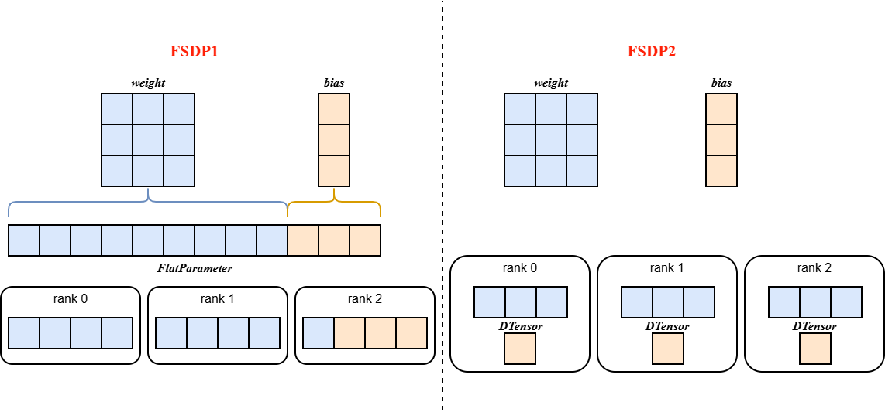
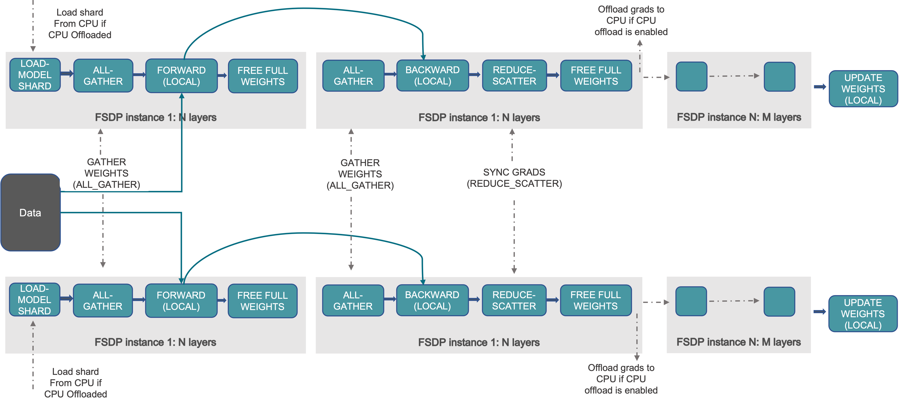

fsdp2
===========================

Last updated: 12/08/2025. Author: zs-derrick

背景与挑战
----------

PyTorch的完全分片数据并行（FSDP）旨在提供一个高性能的即时执行模式实现，包含通信分桶和通信/计算掩盖功能。该API通过将一组参数展平拼接成FlatParameter来表示通信桶。然而，这种FlatParameter设计导致难以对桶内单个参数实施差异化操作（如参数冻结、精度转换等），损害了组合灵活性，同时也使内部实现复杂化（例如状态字典逻辑长达数千行代码且需要额外通信）。

解决方案
--------

基于上述局限性，FSDP2移除了FlatParameter，采用沿0维分片的DTensor表示分片参数，支持对单个参数的便捷操作、无需通信的分片状态字典，以及更简化的初始化流程；同时FSDP2实现了一种改进的内存管理系统，通过避免使用recordStream来降低并确定Device内存使用，且无需任何Host同步。

核心工作机制
------------

1. **参数切分** ：在模型初始化时， ``fully_shard`` 将 ``model.parameters()`` 从普通 ``torch.Tensor`` 按照rank号进行进行切分，并转换为 ``DTensor`` 格式，这些参数会根据设备网格（device mesh）被移动到相应的device上。
2. **前反向传播中的参数聚合与重切分**：

   * ​**参数聚合**​： ``forward/backward`` 的 ``pre_hook`` 负责聚合所有参数，将 ``model.parameters()`` 从 ``DTensor`` 转换回普通 ``torch.Tensor``
   * **参数重切分** ： ``forward/backward`` 的计算完成后， ``post_hook`` 释放未分片的参数（无需通信），并重新将参数转换为 ``DTensor``
3. **自底向上的分组策略** ：在复杂模型中 ``fully_shard`` 应遵循自底向上的应用顺序，例如：应先对每个TransformerLayer层应用 ``fully_shard`` ，再应用于root模型

使用方式
--------

模型继承要求
~~~~~~~~~~~~

对于需要使用FSDP2进行训练的模型，必须继承特定的Mixin类：

.. code:: python

   from mindspeed_mm.models.common.module import MultiModalModule
   from mindspeed_mm.models.transformers.base_model import FSDP2Mixin, WeightInitMixin

   class YourModel(MultiModalModule, FSDP2Mixin, WeightInitMixin)：
       ...

启动命令配置
~~~~~~~~~~~~

使用FSDP2训练时需要配置以下命令行参数：

.. code:: shell

   export CUDA_DEVICE_MAX_CONNECTIONS=2

   --use-torch-fsdp2 \
   --fsdp2-config-path ./fsdp2_config.yaml \
   --ckpt-format torch_dcp \
   --untie-embeddings-and-output-weights \

关键参数说明：

-  ``--use-torch-fsdp2``\ ：启用FSDP2训练模式
-  ``--fsdp2-config-path``\ ：指定FSDP2配置文件路径

配置文件参数说明
~~~~~~~~~~~~~~~~

.. raw:: html

    

    <table>
    <thead>
        <tr style="background-color: #f5f5f5;">
        <th style="text-align: left;">参数分类</th>
        <th style="text-align: left;">参数名称</th>
        <th style="text-align: left;">描述</th>
        <th style="text-align: left;">取值</th>
        <th style="text-align: left;">默认值</th>
        <th style="text-align: left;">注意事项</th>
        </tr>
    </thead>
    <tbody>
        <tr>
        <td rowspan="5" style="vertical-align: middle; font-weight: bold;">基本配置</td>
        <td><code>sharding_size</code></td>
        <td>模型并行分片大小</td>
        <td><code>auto</code>或整数值</td>
        <td>1</td>
        <td><code>auto</code>表示<code>world_size</code>大小</td>
        </tr>
        <tr>
        <td><code><a href="https://docs.pytorch.org/docs/2.7/distributed.fsdp.fully_shard.html#torch.distributed.fsdp.MixedPrecisionPolicy">param_dtype</code></td>
        <td>参数存储和计算数据类型</td>
        <td><code>bf16</code>, <code>fp16</code>, <code>fp32</code></td>
        <td>模型dtype</td>
        <td>训练精度设置</td>
        </tr>
        <tr>
        <td><code>reduce_dtype</code></td>
        <td>梯度通信数据类型</td>
        <td><code>bf16</code>, <code>fp16</code>, <code>fp32</code></td>
        <td><code>none</code></td>
        <td>通信精度设置</td>
        </tr>
        <tr>
        <td><code>output_dtype</code></td>
        <td>前向输出数据类型</td>
        <td><code>bf16</code>, <code>fp16</code>, <code>fp32</code></td>
        <td><code>none</code></td>
        <td>输出精度控制</td>
        </tr>
        <tr>
        <td><code>cast_forward_inputs</code></td>
        <td>前向输入自动类型转换</td>
        <td><code>true</code>/<code>false</code></td>
        <td><code>true</code></td>
        <td>确保输入类型匹配</td>
        </tr>
        <tr>
        <td rowspan="2" style="vertical-align: middle; font-weight: bold;">模块包装</td>
        <td><code>sub_modules_to_wrap</code></td>
        <td>FSDP分片子模块路径</td>
        <td>模块路径字符串列表</td>
        <td>-</td>
        <td>
            <strong>模式语法</strong>: 
            • <code>model.layers.{*}</code>: 匹配所有子模块 
            • <code>model.layers.{0-23}</code>: 匹配层数范围 
            • <code>model.layers.{1,3,5}</code>: 匹配指定层数
        </td>
        </tr>
        <tr>
        <td><code>ignored_modules</code></td>
        <td>排除FSDP管理的模块</td>
        <td>模块路径字符串列表</td>
        <td>-</td>
        <td>格式同<code>sub_modules_to_wrap</code></td>
        </tr>
        <tr>
        <td rowspan="5" style="vertical-align: middle; font-weight: bold;">内存优化</td>
        <td><code>recompute_modules</code></td>
        <td>激活值重计算模块</td>
        <td>模块路径字符串列表</td>
        <td>-</td>
        <td>格式同<code>sub_modules_to_wrap</code> <strong>冲突避免</strong>: 需关闭Megatron重计算功能</td>
        </tr>
        <tr>
        <td><code>use_reentrant</code></td>
        <td>检查点实现类型</td>
        <td><code>true</code>/<code>false</code></td>
        <td><code>true</code></td>
        <td>是否可重入</td>
        </tr>
        <tr>
        <td><code>reshard_after_forward</code></td>
        <td>参数重新聚合时机</td>
        <td><code>true</code>/<code>false</code></td>
        <td><code>true</code></td>
        <td>
            <code>true</code>: ZeRO3(省内存) 
            <code>false</code>: ZeRO2(高性能)
        </td>
        </tr>
        <tr>
        <td><code><a href="https://docs.pytorch.org/docs/2.7/distributed.fsdp.fully_shard.html#torch.distributed.fsdp.CPUOffloadPolicy">offload_to_cpu</code></td>
        <td>参数卸载到CPU</td>
        <td><code>true</code>/<code>false</code></td>
        <td><code>false</code></td>
        <td>启用时需要设置<code>--distributed-backend npu:hccl,cpu:gloo</code></td>
        </tr>
        <tr>
        <td><code>pin_memory</code></td>
        <td>锁定CPU内存</td>
        <td><code>true</code>/<code>false</code></td>
        <td><code>false</code></td>
        <td>仅<code>offload_to_cpu=true</code>时生效</td>
        </tr>
        <tr>
        <td rowspan="2" style="vertical-align: middle; font-weight: bold;">性能调优</td>
        <td><code><a href="https://docs.pytorch.org/docs/2.7/distributed.fsdp.fully_shard.html#torch.distributed.fsdp.FSDPModule.set_modules_to_forward_prefetch">num_to_forward_prefetch</code></td>
        <td>前向预取层数</td>
        <td>整数值</td>
        <td>0</td>
        <td>通信与计算重叠优化</td>
        </tr>
        <tr>
        <td><code><a href="https://docs.pytorch.org/docs/2.7/distributed.fsdp.fully_shard.html#torch.distributed.fsdp.FSDPModule.set_modules_to_backward_prefetch">num_to_backward_prefetch</code></td>
        <td>反向预取层数</td>
        <td>整数值</td>
        <td>1</td>
        <td>通信与计算重叠优化</td>
        </tr>
    </tbody>
    </table>

大模型Meta初始化
~~~~~~~~~~~~~~~~

对于参数量极大的模型训练，推荐启用Meta初始化以避免内存以及加载速度慢等问题：

.. code:: shell

   --init-model-with-meta-device 
   --no-initialization

用户自定义切分策略（可选）
~~~~~~~~~~~~~~~~~~~~~~~~~~

对于模型结构复杂或不便于通过YAML配置的场景，用户可以通过FSDP2Mixin提供的接口自定义切分策略，yaml文件中仅提供\ ``基本配置``\ 即可：

**自定义fully_shard示例**

.. code:: python

   from mindspeed_mm.models.common.module import MultiModalModule
   from mindspeed_mm.models.transformers.base_model import FSDP2Mixin, WeightInitMixin

   class YourModel(MultiModalModule, FSDP2Mixin, WeightInitMixin)：
       def _fully_shard(self, fsdp2_kwargs=None, fsdp2_config=None):
           """
           自定义fully_shard实现
           """

           # 自定义重计算模块（可选）
           set_recompute_modules_to_wrap()

           # 自定义fully_shard包装模块
           set_fullyshard_modules_to_wrap()

           # 自定义预取策略（可选）
           num_to_forward_prefetch = getattr(self.fsdp2_config, "num_to_forward_prefetch", 0)
           num_to_backward_prefetch = getattr(self.fsdp2_config, "num_to_backward_prefetch", 0)
           set_modules_to_prefetch(num_to_forward_prefetch, num_to_backward_prefetch)

更为详细地，可以参考\ ``FSDP2Mixin``\ 实现

使用效果
--------

针对Llama-7B，FSDP2相比FSDP1实现了更高的MFU，峰值内存降低7%，且保持相同的损失曲线。

注意事项⚠️
----------

1、当开启fsdp2训练时，需关闭分布式优化器及其相关配置

2、当开启fsdp2训练时，模型权重的保存格式\ ``ckpt-format``\ 仅支持\ ``torch_dist``\ 或\ ``torch_dcp``

-  配置为\ ``torch_dist``\ ，模型需通过继承\ ``MegatronModule``\ 或自定义来实现\ ``sharded_state_dict()``\ 方法；同时需保证模型中所有权重的0维size均大于或等于sharding_size
-  配置为\ ``torch_dcp``\ ，模型需通过继承\ ``MegatronModule``\ 或自定义来实现\ ``state_dict_for_save_checkpoint()``\ 方法，并且其返回的权重字典需要与\ ``model.state_dict()``\ 的返回值一致

