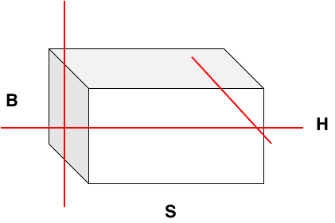
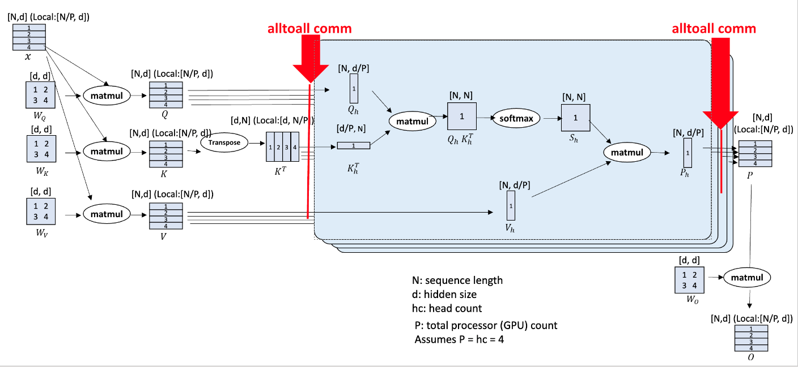
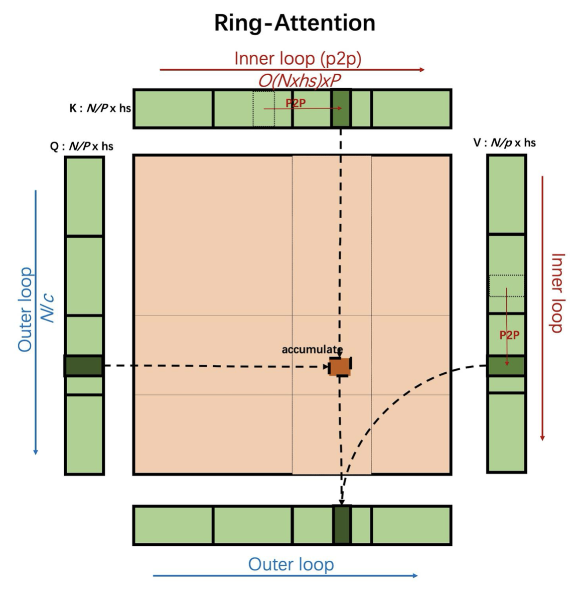
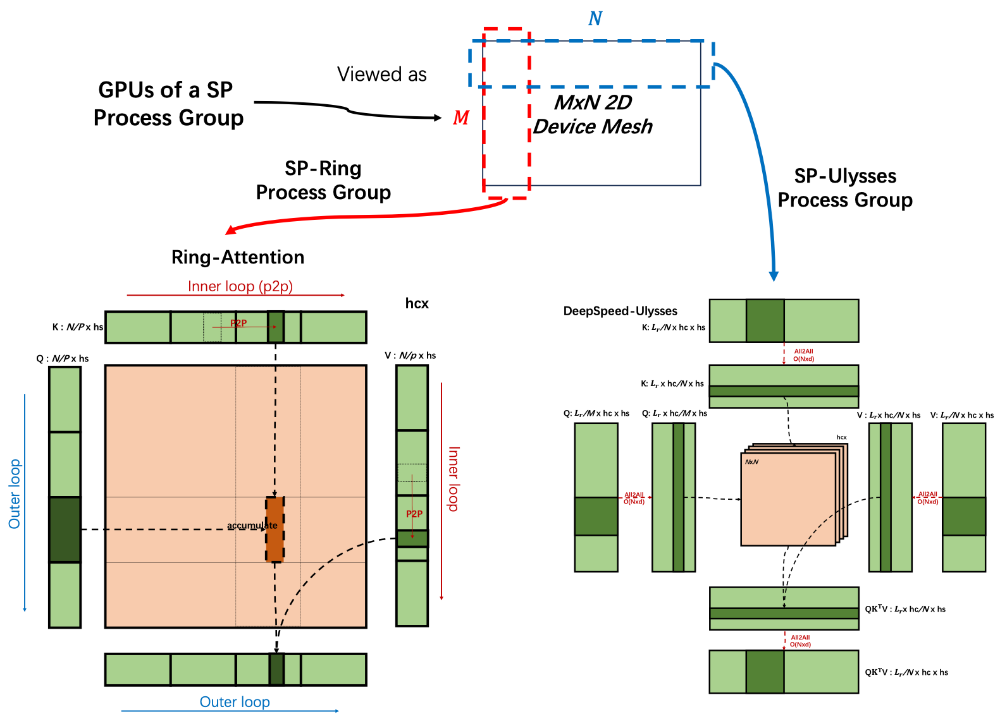
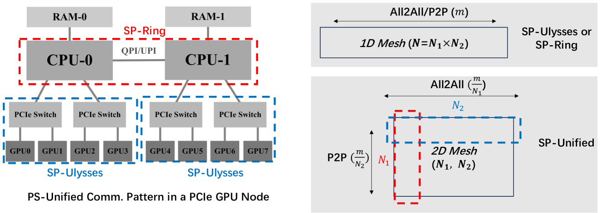
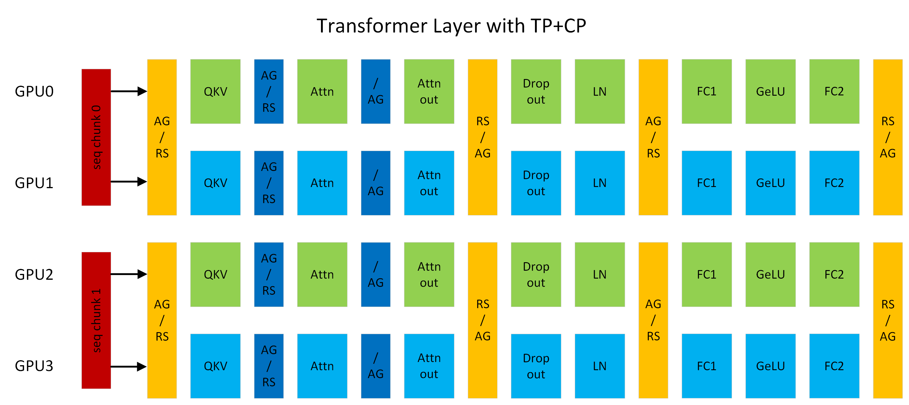

序列并行
===========================

Last updated: 12/04/2025. Author: cxiaolong

背景与挑战
------------

在视觉生成与理解领域，视频数据常因帧数多、分辨率高而产生极长的Token序列（通常超过32K），导致长序列处理成为多模态模型的核心技术挑战。传统分布式训练方法数据并行（DP）、张量并行（TP）与流水线并行（PP）均针对数据的不同维度进行切分，如下图所示，分别对应批大小（batch size）、隐藏层维度（hidden_size）的划分。然而，对于Transformer类模型，其Attention的计算复杂度与序列长度呈平方增长关系，当序列极长时，上述三种并行方式既无法高效利用计算资源，也难以稳定控制显存消耗。
序列并行SP/CP（Sequence Parallelism/Context Parallelism）是一种序列切分的并行化技术，通过将长序列数据的序列维度划分到多个计算设备上。

Ulysses
---------------

Ulysses是DeepSpeed提出的针对长序列模型训练的解决方案。官方博客： `deepspeed-ulysses <https://github.com/deepspeedai/DeepSpeed/tree/master/blogs/deepspeed-ulysses>`_ 。

其核心方案如下：

* 沿序列维度将数据切分至各个NPU (N/cp_size, D)；
* 计算Attention之前，使用 All-To-All 通信把 Query、Key 和 Value 进行聚合，以便每张卡上都具有完整序列长度，同时使得各张卡上只处理部分注意力头，以便并行计算Attention；
* 最后，再使用 All-To-All 来沿着注意力头收集结果，同时沿着序列维度重新分区

使用方式
^^^^^^^^^^^^^

.. raw:: html

    <!DOCTYPE html>
    <html lang="zh-CN">
    <head>
        <meta charset="UTF-8">
        <meta name="viewport" content="width=device-width, initial-scale=1.0">
        <title>长序列并行参数说明</title>
        
    </head>
    <body>
        

            <table>
                <thead>
                    <tr>
                        <th width="350">配置参数</th>
                        <th>参数说明</th>
                    </tr>
                </thead>
                <tbody>
                    <tr>
                        <td>
                            --context-parallel-size [int]
                        </td>
                        <td>
                            必选，设置长序列并行大小，默认为1，根据用户需求配置。
                        </td>
                    </tr>
                    <tr>
                        <td>
                            --context-parallel-algo
                        </td>
                        <td>
                            可选，设置长序列并行算法，默认是ulysses_cp_algo  
                            ulysses_cp_algo：开启Ulysses长序列并行，缺省值。 
                            megatron_cp_algo：开启Ring Attention长序列并行。 
                            hybrid_cp_algo：开启Hybrid长序列并行。
                        </td>
                    </tr>
                </tbody>
            </table>
        

    </body>
    </html>

..  # 这是一个注释，用于保持空行
.. raw:: html

   

.. note::

    num-attention-heads需要够被tensor-model-parallel-size * context-parallel-size整除
    
    * um-attention-heads：表示注意力头数
    * tensor-model-parallel-size：表示张量并行规模
    * context-parallel-size：表示长序列并行大小

..  # 这是一个注释，用于保持空行
.. raw:: html

   

RingAttention
---------------

**Ring Attention** 借鉴了分块 Softmax 的计算思想，无需获取完整序列的全局矩阵，即可实现分块自注意力计算。该方法将自注意力与前馈网络的计算过程分解为多个小块，并将这些块沿序列维度分布到多个计算设备上。

具体而言，Ring Attention 在进程之间构建了一个环状的通信结构（Ring）。每个进程持有本地的 Q、K、V 分块，首先完成本地注意力计算，随后通过在环中逐次向后发送和向前接收相邻进程的 KV 块，以迭代方式逐步完成全部注意力计算。在这种设计中，本地注意力计算与 KV 块的通信可实现流水线并行，理想情况下通信开销可被计算过程完全掩盖。

此外，由于 Ring Attention 在整个计算过程中无需拼接全局数据，其支持的序列长度在理论上可无限扩展，从而为超长序列建模提供了高效且可扩展的并行解决方案。

主要流程为：

* 数据切分：根据cp_size(示例=3)大小，将数据切分，每个rank拿到对应分片数据；
* 分块attention计算：计算分块数据的self-attention值（图中用FA2计算），获得单步数据；
* KV数据交换：rank之间搭建ring网络结构，每个rank与相邻rank交换KV数据；
* 单步计算修正：计算完attention后，需要对输出中间值L进行修正，保证输出正确；
* 计算最终输出：算完所有的分块attention后，对最终结果O进行修正、合并。

使用方式
^^^^^^^^^^^^

.. raw:: html

    <!DOCTYPE html>
    <html lang="zh-CN">
    <head>
        <meta charset="UTF-8">
        <meta name="viewport" content="width=device-width, initial-scale=1.0">
        <title>长序列并行参数说明</title>
        
    </head>
    <body>
        

            <table>
                <thead>
                    <tr>
                        <th width="350">配置参数</th>
                        <th>参数说明</th>
                    </tr>
                </thead>
                <tbody>
                    <tr>
                        <td>
                            --context-parallel-size [int]
                        </td>
                        <td>
                            必选，设置长序列并行大小，默认为1，根据用户需求配置。
                        </td>
                    </tr>
                    <tr>
                        <td>
                            --context-parallel-algo
                        </td>
                        <td>
                            可选，设置长序列并行算法，默认是ulysses_cp_algo  
                            ulysses_cp_algo：开启Ulysses长序列并行，缺省值。 
                            megatron_cp_algo：开启Ring Attention长序列并行。 
                            hybrid_cp_algo：开启Hybrid长序列并行。
                        </td>
                    </tr>
                    <tr>
                        <td>
                            --use-cp-send-recv-overlap
                        </td>
                        <td>
                            可选，建议开启，开启后支持send receive overlap功能  
                        </td>
                    </tr>
                    <tr>
                        <td>
                            --attention-mask-type [general/causal]
                        </td>
                        <td>
                            可选，默认是causal mask计算，设置general代表全量计算  
                        </td>
                    </tr>
                    <tr>
                        <td>
                            --megatron-cp-in-bnsd
                        </td>
                        <td>
                            可选，开启表示使用bnsd格式Attention计算  
                        </td>
                    </tr>
                    <tr>
                        <td>
                            --cp-window-size [int]
                        </td>
                        <td>
                            可选，可选，默认为1，即使用原始的Ring Attention算法；当设置为大于1时，即使用Double Ring Attention算法，优化原始Ring Attention性能，--cp-window-size即为算法中双层Ring Attention的内层窗口大小，需要确保cp_size能被该参数整除  
                        </td>
                    </tr>
                </tbody>
            </table>
        

    </body>
    </html>

..  # 这是一个注释，用于保持空行

.. raw:: html

   

USP(混合并行, Unified SP)
-----------------------------

| **论文标题**: A Unified Sequence Parallelism Approach for Long-Context Generative AI 
| **论文链接**: https://arxiv.org/pdf/2405.07719.pdf 
| **项目地址**: https://github.com/feifeibear/long-context-attention

* Ulysses: 当序列长度和计算设备成比例增加时，通信量保持不变。在All2All操作后，这四个张量的分割从序列维度L转移到注意力头数维度hc。这样，每个注意力头的softmax(QK^T)V计算可以完整地进行，而不会因为张量的分割而中断。
* RingAttention: 可以看作是FlashAttention的分布式版本。在计算输出张量O的各个块时，如果所需的K和V块不在本地可用，则使用点对点（P2P）通信从其他设备获取。这种方法的通信可以以环形方式组织，每个设备同时发送和接收K、V块，允许通信与计算重叠。

Ulysses在增加计算设备和序列长度时能保持恒定的通信量，而Ring-Attention通过计算和通信的重叠隐藏了由SP引入的点对点（P2P）通信成本。然而，DeepSpeed-Ulysses的并行度受到注意力头数的限制，而Ring-Attention在分块矩阵乘法中的计算效率较低。

为了克服这些限制，提出了一种统一的序列并行方法，将DeepSpeed-Ulysses和Ring-Attention的技术结合起来。这种统一方法通过在序列维度上的混合并行策略，允许在不同的计算设备上分别运行DeepSpeed-Ulysses和Ring-Attention，从而优化了通信模式和计算效率。

具体来说，统一的SP方法在一个2D网格的进程组中运行，其中DeepSpeed-Ulysses沿着网格的行进行操作，而Ring-Attention沿着列进行。这种设置不仅提高了模型架构和网络硬件的适应性，还通过更有效的负载平衡和通信模式，提高了整体的计算性能。

使用方式
^^^^^^^^^^^^

.. raw:: html

    <!DOCTYPE html>
    <html lang="zh-CN">
    <head>
        <meta charset="UTF-8">
        <meta name="viewport" content="width=device-width, initial-scale=1.0">
        <title>长序列并行参数说明</title>
        
    </head>
    <body>
        

            <table>
                <thead>
                    <tr>
                        <th width="350">配置参数</th>
                        <th>参数说明</th>
                    </tr>
                </thead>
                <tbody>
                    <tr>
                        <td>
                            --context-parallel-size [int]
                        </td>
                        <td>
                            必选，设置长序列并行大小，默认为1，根据用户需求配置。
                        </td>
                    </tr>
                    <tr>
                        <td>
                            --context-parallel-algo
                        </td>
                        <td>
                            可选，设置长序列并行算法，默认是ulysses_cp_algo  
                            ulysses_cp_algo：开启Ulysses长序列并行，缺省值。 
                            megatron_cp_algo：开启Ring Attention长序列并行。 
                            hybrid_cp_algo：开启Hybrid长序列并行。
                        </td>
                    </tr>
                    <tr>
                        <td>
                            --ulysses-degree-in-cp [int]
                        </td>
                        <td>
                            必选，开启usp后，ulysses cp的并行度大小  
                        </td>
                    </tr>
                </tbody>
            </table>
        

    </body>
    </html>

|

.. note:: 
    * 需要确保 ``--context-parallel-size`` 参数的数值可以被 ``--ulysses-degree-in-cp`` 整除，例如当设置 ``--context-parallel-size 8`` ``--ulysses-degree-in-cp 2`` 时，此时ring cp并行度为4。
    * 需要确保 ``--ulysses-degree-in-cp * --tensor-parallel-size`` 可以被num-attention-heads数整除

TP-SP
^^^^^^^^^^

TP-SP是Megatron-LM框架最早提出的一种序列并行技术，是基于Megatron TP基础上，继续对Transformer模型的 ``Dropout`` 和 ``LayerNorm`` 模块进一步做序列切分，

| **论文链接**: https://arxiv.org/pdf/2205.05198

使用

使用方式
^^^^^^^^^^

.. raw:: html

    <!DOCTYPE html>
    <html lang="zh-CN">
    <head>
        <meta charset="UTF-8">
        <meta name="viewport" content="width=device-width, initial-scale=1.0">
        <title>长序列并行参数说明</title>
    </head>
    <body>
        

            <table>
                <thead>
                    <tr>
                        <th width="350">配置参数</th>
                        <th>参数说明</th>
                    </tr>
                </thead>
                <tbody>
                    <tr>
                        <td>
                            --tensor-parallel-size [int]
                        </td>
                        <td>
                            必选，设置TP并行度，SP和TP同并行度。
                        </td>
                    </tr>
                    <tr>
                        <td>
                            --sequence-parallel
                        </td>
                        <td>
                            必选，设置SP并行  
                        </td>
                    </tr>
                    <tr>
                        <td>
                            --use-ascend-mc2
                        </td>
                        <td>
                            可选，在开启TP和SP的训练场景下，matmul和all_gather/reduce_scatter计算和通信算子融合，减少内存开销并提高计算效率  
                        </td>
                    </tr>
                </tbody>
            </table>
        

    </body>
    </html>

|

.. note:: 

    MoE类模型暂不支持开启--use-ascend-mc2

